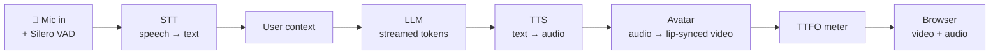

<!--
This file is a hybrid: it renders as a slide deck (Marp / `---` separators) and
also reads as a standalone progress document. Figures are cross-checked against
the code — see the "Source of numbers" note at the end of each measured claim.
-->

# VisualLLm
### Real-time Speech → LLM → Talking-Head Avatar

**Progress update for the advisor**
Updated: **2026-06-14**

> ⚠️ **Historical snapshot (2026-06-14).** This deck records the state and measured
> numbers as of that date and is kept as-is. The stack has since changed (TTS is now
> local **CosyVoice2 on vLLM**, the avatar is **MuseTalk-only**, Ditto/Simli and the
> multi-provider menu below are gone). For current state see **`STATUS.md`** and
> **`WORKFLOW.md`** — those win over anything here.

A conversational AI avatar that **listens, thinks, and speaks back with a
photoreal lip-synced face** — in real time, end-to-end streaming.

- Acceptance target: **time-to-first-output (TTFO) < 8 s**
- Research target language: **Mandarin (zh-TW)** (English prototype first)
- Runs from a remote Windows PC in **Thailand** (the latency challenge)

---

## 1. Problem & goal

We want a **real-time conversational avatar**: the user speaks, and a
photoreal talking head answers — multi-turn, with **barge-in** (you can
interrupt it), fully streaming.

**Why it is hard:** four heavy models run in series (speech recognition →
language model → speech synthesis → face animation). Each adds delay, and the
machine sits in **Thailand** while most cloud AI services live in the **US** —
every cloud hop crosses the Pacific.

**The bar we set:** from the moment the user *stops speaking* to the moment the
avatar *starts speaking* — the **TTFO** — must stay **under 8 seconds** to feel
conversational.

---

## 2. System workflow

The system is a streaming pipeline built on **Pipecat 1.3.0**, delivered to the
browser over **WebRTC**. Each turn flows through 8 stages:



ASCII fallback:

```
🎤 mic → [VAD] → STT → context → LLM → TTS → Avatar(lip-sync) → meter → browser
                              (streamed, sentence-by-sentence)
```

**Two design choices make it feel fast:**
- **Streaming, not batch** — the LLM streams tokens, which Pipecat aggregates
  into *sentences*, so the **first sentence reaches TTS before the full answer
  is generated**.
- **Barge-in** — the VAD runs always-on, so the user can interrupt mid-answer.

*Source: `pipeline/main.py` (pipeline assembly), `pipeline/stages/*.py`.*

---

## 3. The pipeline, stage by stage

| # | Stage | Job | Current provider |
|---|-------|-----|------------------|
| 1 | **VAD / turn-taking** | detect when the user starts/stops talking | Silero (local, always-on) |
| 2 | **STT** | speech → text (streaming) | Deepgram `nova-2` |
| 3 | **Context** | append the user turn to chat history | Pipecat aggregator |
| 4 | **LLM** | generate the reply (streamed) | OpenRouter → Gemini 2.5 Flash Lite |
| 5 | **TTS** | text → audio (fast first chunk) | ElevenLabs Flash v2.5 (voice *Adam*) |
| 6 | **Avatar** | audio → lip-synced video | **MuseTalk (local GPU)** ↔ Simli (cloud) |
| 7 | **Meter** | measure TTFO per turn | `TtfoMeter` |
| 8 | **Transport out** | stream video+audio to the browser | WebRTC |

Every stage is **swappable from a config file** — see §7.

---

## 4. Per-process delays

The **delay budget** is 8 s. Here is where the time goes per turn. Hard
**measured** figures are bold; the rest are **estimated** but independently
reproducible with `scripts/bench_latency.py`.

| Stage | What adds the delay | Delay | Basis |
|-------|---------------------|-------|-------|
| End-of-turn (VAD) | silence held before a turn counts as "finished" | **0.5 s** | configured (`stop_secs`) |
| STT (Deepgram) | streaming transcription, runs as you speak | ~0.1–0.3 s | estimated |
| LLM time-to-first-token | first token (OpenRouter → Gemini, incl. US round-trip) | **~0.9–1.4 s** (median across runs) | measured (2× 5 runs) |
| TTS first audio chunk | first audio bytes back from ElevenLabs | **median 0.22 s** (warm; 2.58 s cold) | measured (5 runs) |
| Avatar — Simli (cloud) | first lip-synced frame | one-time **~10–15 s** warmup, then realtime | measured |
| Avatar — MuseTalk (local) | per-frame render on the GPU | **~32 ms/frame → 20 fps, ~1.14× realtime** | measured |
| **End-to-end TTFO** | **user stops → avatar speaks** | **median 1.97 s · p95 2.86 s** | **measured** |

> **Headline result: TTFO median 1.97 s, p95 2.86 s — comfortably inside the
> 8 s budget** (Phase-1 stack, English).

*Sources: `pipeline/stages/vad.py` (0.5 s), `pipeline/metrics.py` + STATUS.md
(TTFO), `local_services/musetalk_server/app.py` (20 fps / 32 ms), STATUS.md
(Simli warmup). LLM/TTS rows benchmarked live on 2026-06-14 (5 runs each) —
TTS via `python -m scripts.bench_latency --stage tts`; LLM probed directly
against the configured OpenRouter model (`google/gemini-2.5-flash-lite`).*

> **Note on the LLM stage:** at ~0.9–1.4 s it is the single largest delay
> contributor — it carries the **transpacific round-trip** from Thailand to
> OpenRouter's US endpoint. This is the strongest argument for an **Asia-region
> LLM endpoint** (see roadmap). It also explains why the streaming design
> matters: TTS (0.22 s) overlaps with the LLM, so TTFO ≈ VAD + LLM, not the
> sum of all stages.

---

## 5. How we keep it under budget

The naive version of this pipeline easily takes 15–30 s. What we did to get to
~2 s:

1. **Sentence streaming** — TTS starts on the first sentence, not the whole
   reply. The LLM and TTS overlap instead of running back-to-back.
2. **Fast-first-chunk TTS** — ElevenLabs Flash v2.5 with
   `optimize_streaming_latency` returns audio in fractions of a second.
3. **LLM connection pre-warm** — on connect we open the TLS connection to the
   model (and speak a fixed greeting with *no* LLM round-trip), so the first
   real turn isn't paying a cold-start tax. *(`pipeline/main.py`)*
4. **VAD tradeoff** — `stop_secs = 0.5` is the single biggest TTFO lever:
   shorter = snappier but risks cutting the user off; longer = safer but adds
   directly to TTFO. We tuned it to 0.5 s. *(`pipeline/stages/vad.py`)*
5. **Going local for the avatar** — eliminates the transpacific round-trip
   entirely for the heaviest stage (next slide).

---

## 6. Phase 3 — local MuseTalk avatar (the big latency win)

**Problem:** the cloud avatar (Simli, US servers) cost **~10–15 s warmup per
connection**, plus video stutter and occasional session failures — all from the
**Thailand → US** link. The loading overlay *hid* the wait but couldn't remove
it.

**Solution:** run the talking-head model **locally on the GPU** (NVIDIA
Blackwell 5060 Ti, cu128 PyTorch). MuseTalk v1.5 as a standalone FastAPI +
WebSocket server; the pipeline talks to it over a local socket — **no cloud
hop**.

**Engineering highlights:**
- **Streaming inference** — audio arrives in PCM chunks; UNet/VAE run on
  8-frame segments, so the avatar starts talking *mid-utterance*.
- **No mmpose/DWPose** — that path needs a CUDA compiler/MSVC not on this box.
  Replaced the 68-landmark detector with `face_alignment` (pure-torch, pip),
  feeding MuseTalk's exact bbox math. Landmarks run **once**, at avatar prep,
  then cached.
- **Steady 20 fps pump** — mobile WebRTC decoders froze on bursty frames, so
  the server emits a paced, smooth video track (repeat last frame if the next
  isn't ready).

**Result:** **~32 ms/frame GPU floor → 20 fps, ~1.14× realtime**, VRAM
~4–6 GB. Headless verified (engine, websocket round-trip, `/health`).

**Open caveat:** audio is forwarded immediately while video lags by render
time → lips may trail the voice **~0.5–0.8 s**; fix is to pair audio with frames
in `musetalk_video.py` if visible in-browser.

*Source: `local_services/musetalk_server/app.py`.*

---

## 7. Modular by design — one config file re-points everything

Every stage reads its provider from `.env` (`pipeline/config.py`) — **no code
change** to switch model, vendor, or language. This is what makes the
**English → Mandarin** and **cloud → local** transitions cheap.

| Stage | Options available today |
|-------|-------------------------|
| STT | `deepgram` (default) · `sherpa` (local streaming, zh-en, CPU) · `funasr` (local segmented SenseVoice, zh) |
| LLM | `openai` · `anthropic` · `openrouter` · `qwen_local` |
| TTS | `elevenlabs` · `cartesia` · `azure` · `cosyvoice_local` · `kokoro_local` |
| Avatar | `simli` (cloud) · `musetalk_local` · `heygen` |

The avatar can even flip **local ↔ cloud at runtime** (a UI toggle writes
`avatar_mode.txt`, applied on the next reconnect — no restart).

---

## 8. Status

| Milestone | State |
|-----------|-------|
| **Phase 1** — full cloud pipeline, English, TTFO measured | ✅ Done (1.97 s median) |
| **Phase 3** — local MuseTalk avatar replaces Simli | ✅ Done, headless-verified |
| Phone access over Tailscale HTTPS | ✅ Working |
| In-browser lip-sync + audio/video-sync check | 🔶 Verifying |
| Swap demo face for our own portrait | 🔶 Pending |
| Source on GitHub + team access | ✅ Private repo, 2 collaborators |
| **Phase 2** — Mandarin (zh-TW) swap | ⏭️ Next |

Access: WebRTC at `/client`; phone via
`https://porsche-pc.tail21bb8a.ts.net/client` (Tailscale).
Code: private GitHub repo, shared with collaborators for review.

---

## 9. Roadmap / next steps

1. **Verify audio/video sync** in-browser; fix the ~0.5–0.8 s lip lag if
   visible.
2. **Mandarin (zh-TW) swap** — the real research target. Candidate stack:
   - STT: **FunASR Paraformer** (strongest streaming zh) or Azure (Asia region)
   - LLM: **Qwen / DeepSeek** via OpenRouter or a local Qwen2.5-7B
   - TTS: **CosyVoice2** (local, native zh-TW) or Azure zh-TW neural voice
3. **Cut the LLM hop** — try an **Asia-region** model endpoint to shave the
   transpacific RTT off the LLM stage.
4. Swap in our own avatar face; housekeeping (rotate the OpenRouter key).

---

## 10. Appendix — how to run & reproduce the numbers

**Run (Phase 3, local avatar — two processes):**
```
# 1) start the local MuseTalk server (dedicated `musetalk` conda env)
local_services\musetalk_server\run_server.bat
# 2) start the pipeline
python -m pipeline.main          # serves http://localhost:7860/client
```

**Reproduce the latency figures:**
```
python -m scripts.bench_latency --stage llm   # LLM time-to-first-token
python -m scripts.bench_latency --stage tts   # TTS time-to-first-audio
```
End-to-end **TTFO** is logged live per turn (`[TTFO]`) and summarized
(median / p95 / max / pass) on disconnect — see `pipeline/metrics.py`.

**Key files:** `pipeline/main.py` (assembly, warmup), `pipeline/config.py`
(provider selection), `pipeline/stages/*.py` (per-stage), `pipeline/metrics.py`
(TtfoMeter), `local_services/musetalk_server/app.py` (local avatar).
