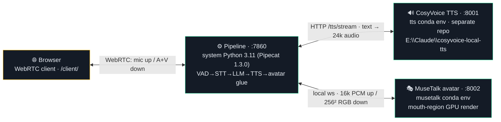
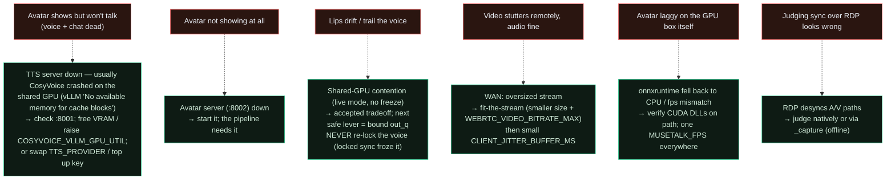

# VisualLLm — System Workflow Diagram (Mermaid, drill-down)

A production-grade, end-to-end map of the **speech → STT → LLM → TTS → talking-head avatar**
pipeline. Each phase is a `subgraph` that nests its discrete subprocess steps; `click` a node to
jump to the source file. **Dashed** edges are fallback branches, the barge-in loop, and error paths.

> Source of truth: [`STATUS.md`](../STATUS.md) (live state) · [`WORKFLOW.md`](../WORKFLOW.md)
> (full workflow) · [`CLAUDE.md`](../CLAUDE.md) (conventions). Current default stack: **CosyVoice
> TTS (:8001) + MuseTalk avatar (:8002)**, live/audio-master A/V sync. Companion interactive page:
> [`workflow-interactive.html`](./workflow-interactive.html). (The older
> [`workflow.html`](./workflow.html) is flat + stale — kept, superseded by these.)

## Process topology

## End-to-end turn (phases drilled into subprocesses)

```mermaid
flowchart TD

  %% ---------- PHASE 1: CAPTURE ----------
  subgraph P1["① Capture & Ingestion — browser → pipeline"]
    direction TB
    P1a["Browser mic — WebRTC capture<br/>user speaks into /client/"]
    P1b["SmallWebRTCTransport.input()<br/>audio frames enter the graph"]
    P1c["ICE pinned to Tailscale 100.64/10<br/>_restrict_ice_to_subnet · WEBRTC_ICE_SUBNET"]
    P1d["Silero VAD (local, always-on)<br/>stop_secs hold → ends the user turn"]
    P1a --> P1b --> P1c --> P1d
  end

  %% ---------- PHASE 2: STT ----------
  subgraph P2["② Listen / STT — speech → text"]
    direction TB
    P2a["Stream mic audio → Deepgram nova-2 (ws)"]
    P2b["Language by LANGUAGE<br/>en-US / zh-TW / th"]
    P2c["Interim partials + smart-format"]
    P2d["VAD stop → final TranscriptionFrame"]
    P2a --> P2b --> P2c --> P2d
  end

  %% ---------- PHASE 3: LLM ----------
  subgraph P3["③ Think / Context + LLM"]
    direction TB
    P3a["User context aggregator → LLMContextFrame"]
    P3b["LLM pre-warmed on connect (no cold start)"]
    P3c["OpenRouter (OPENROUTER_MODEL)<br/>streamed tokens"]
    P3d["System prompt: spoken-style<br/>(en / zh / th)"]
    P3f["Sentence aggregation<br/>first sentence → TTS early"]
    P3a --> P3b --> P3c --> P3d --> P3f
  end

  %% ---------- PHASE 4: TTS ----------
  subgraph P4["④ Speak / TTS — text → audio"]
    direction TB
    P4a["CosyVoice2-0.5B /tts/stream (:8001)<br/>female zero-shot voice"]
    P4b["COSYVOICE_PACE_RATE=1.3<br/>caps GPU burst on shared card"]
    P4c["Streamed chunks → resample 16 kHz mono"]
    P4a --> P4b --> P4c
    P4f1["fallback: ElevenLabs flash_v2_5"]
    P4f2["fallback: Deepgram Aura (en-only)"]
    P4a -.->|"TTS_PROVIDER=elevenlabs"| P4f1
    P4a -.->|"TTS_PROVIDER=deepgram"| P4f2
  end

  %% ---------- PHASE 5: AVATAR ----------
  subgraph P5["⑤ Render / Avatar — audio → lip-synced video"]
    direction TB
    subgraph P5C["client · musetalk_video.py"]
      direction TB
      P5a["Resample → 16 kHz PCM"]
      P5b["Real-time-paced feed (_feed_q)<br/>no video backlog"]
      P5a --> P5b
    end
    subgraph P5S["server · musetalk_server/app.py (:8002)"]
      direction TB
      P5c["ws wire: config / speech_start|end / reset"]
      P5d["Mouth-region render · AVATAR_REF portrait"]
      P5e["Single-client session guard"]
      P5f["Idle / neutral frame between turns"]
      P5c --> P5d --> P5e --> P5f
    end
    P5sync["A/V sync = LIVE / audio-master<br/>MUSETALK_SYNC_MODE=live<br/>voice forwarded immediately → never freezes<br/>lips best-effort · LEAD/END_TAIL frames"]
    P5b --> P5c
    P5d --> P5sync
  end

  %% ---------- PHASE 6: DELIVER ----------
  subgraph P6["⑥ Deliver / Sync out & loop"]
    direction TB
    P6a["TtfoMeter — UserStopped → BotStarted (< 8 s)"]
    P6b["transport.output() → WebRTC A+V → browser"]
    P6c["One fps everywhere<br/>server stride = client clock = video_out_framerate"]
    P6d["Assistant aggregator records turn<br/>next turn sees full history"]
    P6a --> P6b --> P6c --> P6d
  end

  %% ----- main flow -----
  P1 --> P2 --> P3 --> P4 --> P5 --> P6
  P6 -.->|"barge-in: user speaks over avatar → cancel + new turn"| P1

  %% ----- remote viewing -----
  P6r["Remote: tailscale serve HTTPS<br/>_install_client_jitter_buffer (CLIENT_JITTER_BUFFER_MS)<br/>WEBRTC_VIDEO_BITRATE_MAX · fit-the-stream size<br/>open /client/ WITH trailing slash"]
  P6b -.->|"WAN viewer"| P6r

  %% ----- click-throughs to source -----
  click P1b "../pipeline/main.py" "pipeline/main.py"
  click P1d "../pipeline/stages/vad.py" "stages/vad.py"
  click P2a "../pipeline/stages/stt.py" "stages/stt.py"
  click P3c "../pipeline/stages/llm.py" "stages/llm.py"
  click P4a "../pipeline/stages/tts.py" "stages/tts.py"
  click P5b "../local_services/musetalk_video.py" "musetalk_video.py"
  click P5d "../local_services/musetalk_server/app.py" "musetalk_server/app.py"
  click P6a "../pipeline/metrics.py" "pipeline/metrics.py"

  %% ----- styling -----
  classDef cap fill:#10182a,stroke:#60a5fa,color:#e8edf4;
  classDef stt fill:#0d1d22,stroke:#22d3ee,color:#e8edf4;
  classDef llm fill:#231a07,stroke:#fbbf24,color:#e8edf4;
  classDef tts fill:#241320,stroke:#f472b6,color:#e8edf4;
  classDef av  fill:#16122a,stroke:#a78bfa,color:#e8edf4;
  classDef out fill:#0e1b14,stroke:#34d399,color:#e8edf4;
  classDef alt fill:#1a1410,stroke:#647288,color:#9fb0c3,stroke-dasharray:4 3;

  class P1a,P1b,P1c,P1d cap;
  class P2a,P2b,P2c,P2d stt;
  class P3a,P3b,P3c,P3d,P3f llm;
  class P4a,P4b,P4c tts;
  class P5a,P5b,P5c,P5d,P5e,P5f,P5sync av;
  class P6a,P6b,P6c,P6d out;
  class P4f1,P4f2,P6r alt;
```

## Error & troubleshooting paths

## Legend

| Color | Phase |
|---|---|
| 🔵 blue | Capture / WebRTC transport |
| 🟢 teal | STT |
| 🟡 amber | LLM (the bottleneck — carries the transpacific hop) |
| 🩷 pink | TTS |
| 🟣 violet | Avatar render + A/V sync |
| 🟢 green | Deliver / measure / loop |
| ⬜ dashed grey | Fallback branch, barge-in loop, remote path |

**Streaming overlap (why TTFO is small):** the LLM's *first sentence* reaches TTS before the full
answer exists, and TTS's *first chunk* reaches the avatar immediately — so end-to-end
TTFO ≈ **VAD + LLM**, not the sum of every stage. Measured: median **1.97 s**, p95 **2.86 s**,
against the **< 8 s** acceptance bar.
